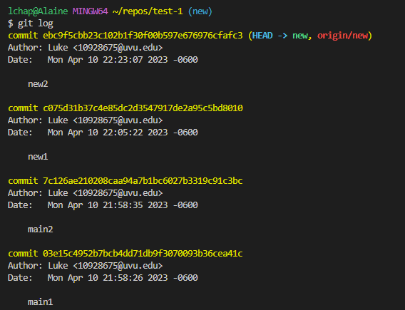
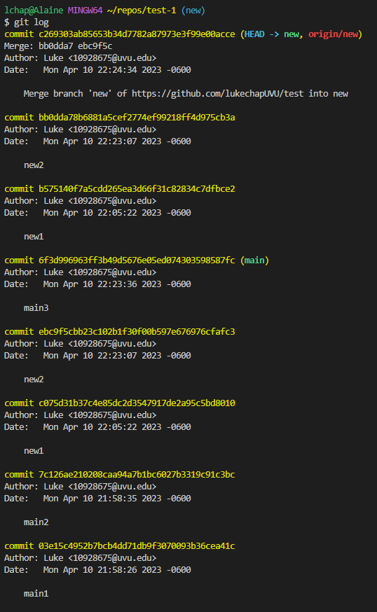
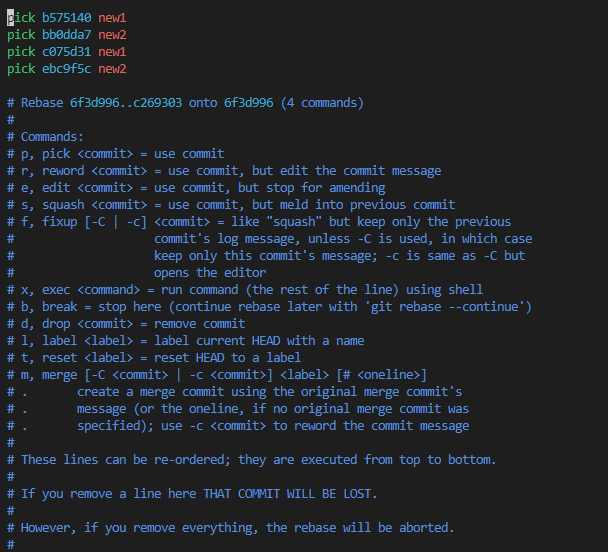

### Git Basics
* What is Git?
*Git is a version control system used for tracking changes in source code*
* Why use Git? What problem does it slove?
*Git solves several problems related to software development, such as collaboration, version control, and code management.*
* What is the difference between Git and Github?
*Git is a version control system used for tracking changes in source code, while GitHub is a web-based platform for hosting and collaborating on Git repositories.*

### Git rebase

* What is Git rebase?
*Git rebase is a Git command that allows you to modify the history of a Git branch by applying a set of commits from one branch onto another. When you run git rebase, Git will take the changes from the specified branch and replay them onto the current branch.*
* What are some advantages and disadvantages of Git rebase? (At least 2 of each)
#### Advantages
*Git rebase allows you to create a cleaner and more organized commit history, which makes it easier to review and understand changes.*
*By rewriting your branch's commit history, you can minimize merge conflicts.*
#### Disadvantages
*If you're not careful, using Git rebase can result in losing changes or introducing bugs.*
*When you use Git rebase to rewrite your branch's history, it can make it difficult to understand what changes were made and why.*
* When shouldn't you use Git rebase? Why?
*When you need to preserve the original commit history because it rewrites the history of your branch by applying a set of commits from another branch.*
*When you are collaborating with other developers since it can confuse other developers who aren't familiar with git rebase.*

Create a new repo and demonstrate your knowledge of the following items with screenshots:
* A rebase merge

* An interactive rebase merge

* When you shouldn't rebase with a remote repo.

*If you're working on a public or shared branch*

### Git reset, checkout, and revert

* What is Git reset?
  *Git reset is a command which allows you to move your repository back to a previous commit thus discarding any changes made in commits after the commit you choose.*
* What is the difference between hard, mixed and soft?
   *Soft will uncommit any changes but they are left staged, mixed will uncommit and unstage any changes but they are left in working tree, and hard will uncommit, unstage, and delete any changes.*
* What is Git checkout?
   *Git checkout is a command that moves the user from the current branch to the branch specified in the checkout command line.*
* What is Git revert?
   *Git revert is a command which takes a previous commit and adds it as a new commit.*
* In what ways are these commands the same and what ways are they different?
   *Reset would be used when you want to undo any and all work that has been done since a specific commit. Checkout is used for when you want to branch off and take the code into a different direction while keeping the integrity of the original branch. Revert would be used if you wanted to revert some changes made in a previous commit (like re-adding a file that was deleted), but you don't want to lose all of the new changes made since the commit you chose for the revert.*

### Git submodules

* What are Git submodules?
   *Git submodules are external repositories that the main repository depends and are linked at a specific path in the parent repository.*
* When would you use a submodule?
   *Submodules are often used in complex projects. An example of a time you would use a submodule is if you wanted to use a library's source code, but you want to be able to make changes to the library's source code while also being able to keep updated with the codebase of the library.*
* What are the advantages and disadvantages of Git submodules?
   *Submodules are a great way to distribute several repositiories all as one, but having submodules requires you to treat each submodule as its own separate repository thus making the parent repository much more complex to work with.*
